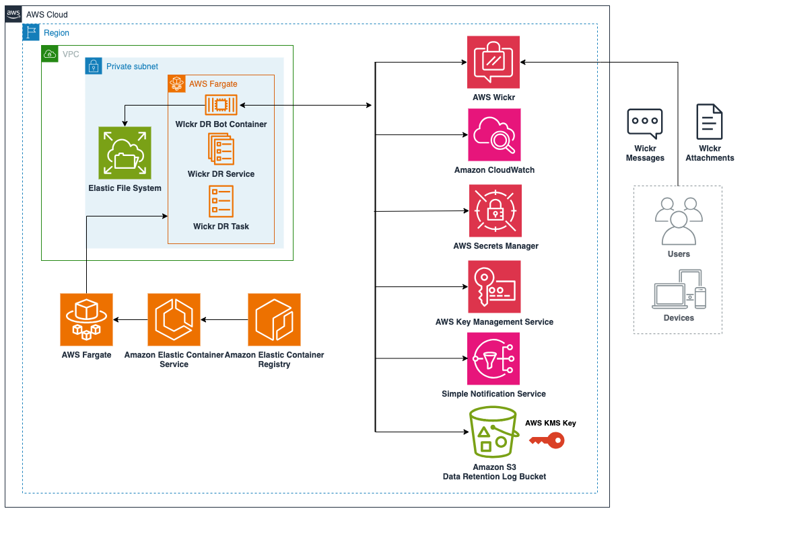
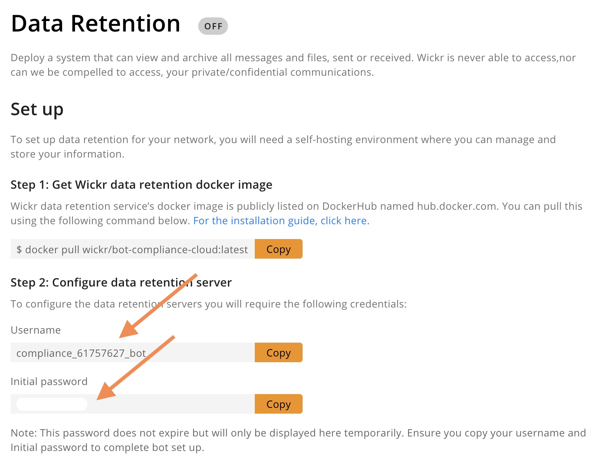
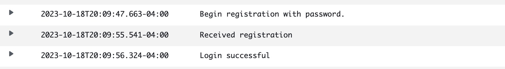
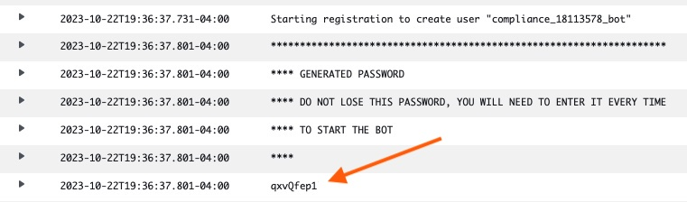
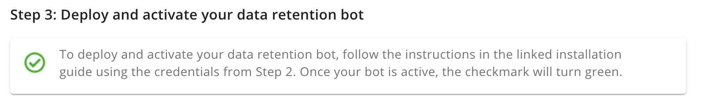
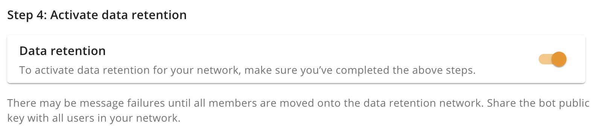
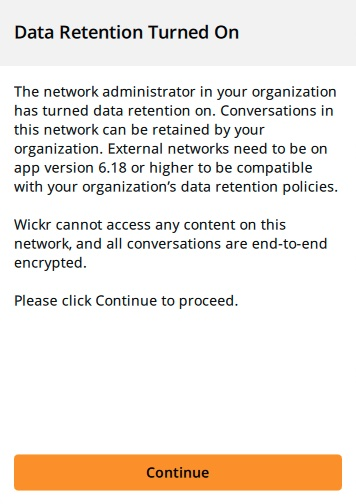
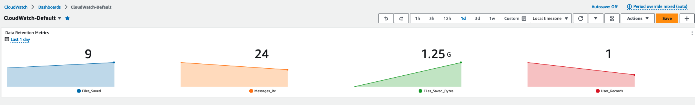
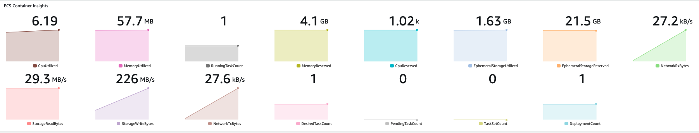

# AWS Wickr Data Retention on Fargate

## Description
This AWS CloudFormation script will deploy all the necessary resources required to deploy AWS Wickr data retention bot on AWS Fargate.  Fargate is a logical choice to run the Data Retention bot since it delivers Serverless computer for containers which eases the administrative burden of managing an Amazon Elastic Compute Cloud (EC2) instance data retention host.

The script will deploy the following resources:
-   Amazon Elastic Container Service (ECS) cluster
-   Amazon ECS service
-   Amazon ECS task definition
-   Amazon Elastic File System (EFS) persistent bot filestore
-   AWS Secrets Manager secret to pass data retention bot configuration parameters
-   An Amazon Virtual Private Cloud (VPC) with all the necessary networking infrastructure
-   AWS Identity and Access Management (IAM) roles and policies to allow ECS and current user to access necessary services
-   An Amazon Simple Storage Service (S3) bucket to store your AWS Wickr data retention logs
-   An S3 bucket to log requests made to the data retention bucket
-   AWS Key Management Service (KMS) keys to secure applicable resources
-   Amazon CloudWatch logging
    -   Log group for bot logs
    -   Metrics for bot usage
    -   Metrics for ECS service and cluster
-   Amazon Simple Notification Service (SNS) topic for alerting

&nbsp;  
**Architecture:**
<center></center>
&nbsp;  
&nbsp;

## Instructions
### Prerequisites
There are a couple pre-requisites that must be satisfied before you can deploy the CloudFormation template:
-   AWS CLI tool (https://docs.aws.amazon.com/cli/latest/userguide/getting-started-install.html)
-   AWS Wickr network (https://docs.aws.amazon.com/wickr/latest/adminguide/getting-started.html)

### Pre-Deploy

The primary mechanism for supplying required environmental variables for the data retention bot deployment is Secrets Manager.  However, at the time this repo was published AWS Wickr does not have an AWS API to programmatically manage AWS Wickr resources.  Therefore, in order to assign bootstrap values to a Secrets Manager secret, you will need to manually fetch the environmental variables for:
-   Data retention bot name (`DrBotName`)

-   Data retention bot initial password (`DrBotPw`)

A screenshot of these two variables can be seen below in the Data Retention section of the AWS Wickr admin console:
<center></center>

<br/><br/>
Some other variables that you will need to pass at the time of deployment :
-   `stack-name` : A friendly name for the CloudFormation stack
-   `region` : AWS Wickr at the time of this writing is currently supported in 
    -   us-east-1
    -   ap-southeast-2
    -   ca-central-1
    -   eu-west-2
-   `DeployName` : A name for the deployment that will be used for naming and tagging resources
-   `FileRotateMins` : The time in minutes before the data retention file is rotated and sent to your S3 bucket.  For demo purposes choose a small value to quickly see files being populated

### Deploy
To deploy, first clone this repository and `cd` to the root directory where the `template.yaml` file is located.  you will need to run a `aws cloudformation deploy` command constructed like the following:

```
aws cloudformation deploy \
--stack-name <stack_name_here> \
--region <aws_region> \
--template-file template.yaml \
--capabilities=CAPABILITY_NAMED_IAM \
--parameter-overrides \
DeployName=<deployment_name_here> \
DrBotName=<bot_username_here> \
DrBotPw=<initial_bot_pw>  \
FileRotateMins=1
```

The stack will take about 10 minutes to deploy.  A log group named `/ecs${DeployName}` will be created and will start logging activity from the bot container as soon as it becomes active.  This is a good log to monitor to see if your deployment is successful.  When the bot successfully registers you will see a log that looks like this:

<center></center>
<br/><br/>

**Important:** After the bot registers with the initial password a new password will be generated.  This password will be needed for any future bot logins to your network.  For example, if the CloudFormation stack is deleted and re-deployed, then this is the password the network will be expecting.  Make note of this password and update the Secrets Manager secret that was generated in the stack.  This password can be viewed and retrieved in the CloudWatch log group:

<center></center>

<br/><br/>
Browse to your AWS Wickr Network Admin Console and look at the data retention tab. A green checkmark denotes that your broadcast bot on Fargate is successfully registered to your AWS Wickr Network:

<center></center>
<br/><br/>

Finally, click the Data Retention slider button to enable Data Retention for your AWS Wickr network and begin the flow of messages to your S3 bucket.
<center></center>
<br/><br/>

You should also see a Wickr client notification that Data Retention is active:


<p align="center">

</p>
<br/><br/>

### Post-deployment notes
-   The data retention Bot is designed to ship AWS Wickr network activity, messages, and attachments straight to your configured S3 bucket for storage and analysis.  Persistent storage is not required, however it is best practice due to the way the bot registers with the AWS Wickr cloud service.  Persistent storage, like the EFS file system configured in this stack, allow for a long-lived Wickr client that will not be interpreted as a new device upon container cycle

### Updating the stack

It is common to update CloudFormation stacks to add new resources or to change environmental variables supplied at deployment.  An example of updating the stack with a longer file rollover time (`FileRotateMins`) with a value of 30 minutes would look like this:
```
aws cloudformation update-stack \
--stack-name <stack_name_here> \
--region <aws_region> \
--template-body file://template.yaml \
--capabilities=CAPABILITY_NAMED_IAM \
--parameters \
ParameterKey=DeployName,ParameterValue=<deployment_name_here> \
ParameterKey=DrBotName,ParameterValue=<bot_username_here> \
ParameterKey=DrBotPw,ParameterValue=<updated_bot_pw_here>  \
ParameterKey=FileRotateMins,ParameterValue=30
```
**Important**: Make sure that when you update your stack you include the new bot password that is available in your CloudWatch log group during initial registration

### Accessing Data Retention Logs

An S3 bucket has been created that will store the data retention logs.  The name of the bucket should be `${AccountId}$-{DeployName}-wickrdr`.  Check the CloudFormation output values to find the exact name of the bucket.  Once messages and attachments are sent from Wickr clients on the network the data retention logs will populate into the `/data-retention` folder

### Other Outputs

**CloudWatch Metrics**

A CloudWatch metrics group will be visible in the metrics section of your CloudWatch console in the namespace `WickrIO`.  This namespace will provide basic metrics for the data retention bot in your network for things like files and messages sent as well as errors.  An example of a basic CloudWatch dashboard built on the sum of files with total bytes sent, messages sent, and user records captured in a day:
<center></center>
<br/><br/>

>   For more information about the metrics available for the Wickr data retention bot, see the metrics section in the official AWS Wickr data retention documenation: [Wickr data retention CloudWatch metrics](https://docs.aws.amazon.com/wickr/latest/adminguide/metrics-events.html#cloudwatch-metrics)

<br/><br/>
**ECS Container Insights**

ECS Container Insights will create a CloudWatch log group with a name of `/aws/ecs/containerinsights/${DeployName-Cluster/performance}` and will also report Metrics in the namespace `ECS/ContainerInsights`.  These metrics are all specific to your data retention bot cluster and service and will capture data like cpu and memory utlization.

An example of a basic dashboard based on Container Insights for your data retention bot cluster and service:
<center></center>
<br/><br/>

>   For more information on how ECS Container Insights work, visit the official AWS Container Insights documentation: [Using Container Insights](https://docs.aws.amazon.com/AmazonCloudWatch/latest/monitoring/ContainerInsights.html)

<br/><br/>
**S3 Access Logs**

Access logs for your Wickr data retention S3 bucket will be located in a bucket named `${AccountId}-${DeployName}-wickrdrlogging`.  These logs will capture all the data retention bot `PutObject` calls for retention log uploads as well as any administrative user actions on the bucket like `ListObjects` and `GetObject`

### Clean up
To completely delete the stack, you will need to first delete the CloudWatch log group and S3 resources that have retain and version policies.  To find these resources, run the following commands and take note of the resource names:

For S3 buckets:

`aws s3api list-buckets --query "Buckets[?contains(Name, 'wickrdr')].Name"`

For Wickr DR log group:

`aws logs describe-log-groups --query "logGroups[?contains(logGroupName, 'wickrdr')].logGroupName"`

For ECS Container Insights log group, taking note to add the deploy name variable:

`aws logs describe-log-groups --query "logGroups[?contains(logGroupName, '<deploy_name_here>-cluster')].logGroupName"`

Delete the objects in the S3 version-controlled buckets using the bucket names returned in the above commands (both data retention bucket and logging bucket):

```
aws s3api delete-objects --bucket <bucket_name_here> \
--delete "$(aws s3api list-object-versions \
--bucket "<bucket_name_here>" \
--output=json \
--query='{Objects: Versions[].{Key:Key,VersionId:VersionId}}')"
```
After the buckets are emptied, delete the buckets by running:

`aws s3 rb s3://<bucket_name_here>`

To delete the log groups, run the following command using the names returned in the above commands:

`aws logs delete-log-group --log-group-name <log_group_name_here>`

Once the S3 buckets and log group are deleted you can delete the remaining stack resources by running:

`aws cloudformation delete-stack --stack-name <stack_name_here>`

## Security

See [CONTRIBUTING](CONTRIBUTING.md#security-issue-notifications) for more information.

## License

This library is licensed under the MIT-0 License. See the LICENSE file.

